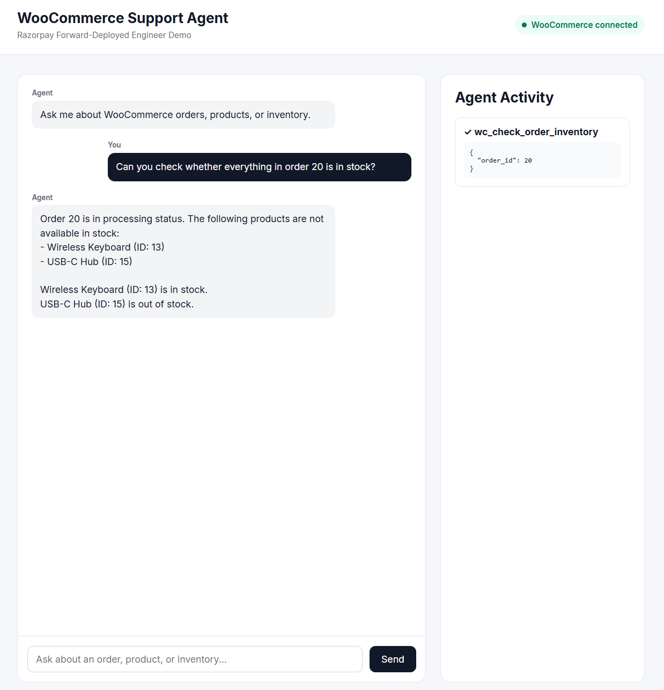

# Razorpay FDE Assignment — WooCommerce Private Connector

A read-only WooCommerce connector built for the Razorpay Forward-Deployed Engineer, Agent Studio assignment.

The project demonstrates how an agent can securely read merchant order, product, and inventory data through a structured connector interface.

## Features

- Read-only WooCommerce integration
- API-key authentication
- Order list/get/search primitives
- Product list/get/search primitives
- Inventory lookup
- Higher-level order inventory check
- MCP server using FastMCP
- Retry and rate-limit handling
- FastAPI backend
- React/Vite demo frontend
- Local agent orchestration using Ollama
- Automated tests

## Architecture

```text
React Frontend
      |
      v
FastAPI Chat API
      |
      v
Local Agent (Ollama)
      |
      v
Connector Tools
      |
      +------------------+
      |                  |
      v                  v
FastMCP Server     WooCommerce Client
                         |
                         v
                 WooCommerce REST API
```

The MCP server is the primary connector interface.

The React/FastAPI/Ollama stack is included as a demo client showing how an agent can use the same connector primitives.

## Demo

The demo client shows a merchant asking a natural-language question while the activity panel exposes the connector tool call used to answer it.



## Supported Tools

### Orders

- `wc_list_orders`
- `wc_get_order`
- `wc_search_orders`

### Products

- `wc_list_products`
- `wc_get_product`
- `wc_search_products`

### Inventory

- `wc_get_inventory`
- `wc_check_order_inventory`

All tools are read-only.

## Authentication

The connector uses WooCommerce REST API Consumer Key and Consumer Secret credentials.

Generate a key from:

`WooCommerce → Settings → Advanced → REST API`

Use **Read** permissions only.

Credentials must be stored in `.env` and must never be committed.

## Setup

### Requirements

- Python 3.12+
- Node.js 20+
- WooCommerce test store
- Ollama
- `qwen2.5:1.5b`

### Backend

```bash
cd backend
python -m venv venv
```

Activate the virtual environment.

Windows:

```powershell
venv\Scripts\activate
```

macOS/Linux:

```bash
source venv/bin/activate
```

Install dependencies:

```bash
pip install -r requirements.txt
```

Copy the environment file.

Windows:

```powershell
copy .env.example .env
```

macOS/Linux:

```bash
cp .env.example .env
```

Fill in your WooCommerce credentials.

Run the backend:

```bash
uvicorn app.main:app --reload
```

The API will be available at:

`http://localhost:8000`

Swagger documentation:

`http://localhost:8000/docs`

## MCP Server

From the `backend` directory:

```bash
python -m app.mcp.server
```

The MCP server runs over stdio.

## Ollama

Install Ollama and pull the local model:

```bash
ollama pull qwen2.5:1.5b
```

Ollama normally runs locally at:

`http://localhost:11434`

## Frontend

From the repository root:

```bash
cd frontend
npm install
npm run dev
```

The frontend will normally be available at:

`http://localhost:5173`

## Example Queries

```text
Show order 20
```

```text
Can you check whether everything in order 20 is in stock?
```

```text
Show recent processing orders
```

```text
Find Wireless Keyboard
```

```text
Is the USB-C Hub available?
```

## Example Agent Flow

User:

```text
Can you check whether everything in order 20 is in stock?
```

The agent calls:

```text
wc_check_order_inventory(order_id=20)
```

The connector retrieves the order and checks the current inventory for the products in that order.

The agent then returns a concise merchant-facing answer.

## Testing

Run:

```bash
cd backend
python -m pytest -v
```

Current tests cover:

- successful API requests
- authentication failures
- not-found handling
- rate-limit retries
- transient 5xx retries
- order serialization
- product serialization
- order inventory evaluation

## Security

- No credentials are committed
- `.env` is gitignored
- API keys use read-only permissions
- Connector performs no mutations
- Demo data is fictional
- Production TLS verification is enabled by default

## Local Development Note

LocalWP may use a self-signed TLS certificate.

For local testing only:

```env
VERIFY_SSL=false
```

Production deployments should use:

```env
VERIFY_SSL=true
```

## Limitations

See:

`docs/LIMITATIONS.md`

## Architecture Details

See:

`docs/ARCHITECTURE.md`